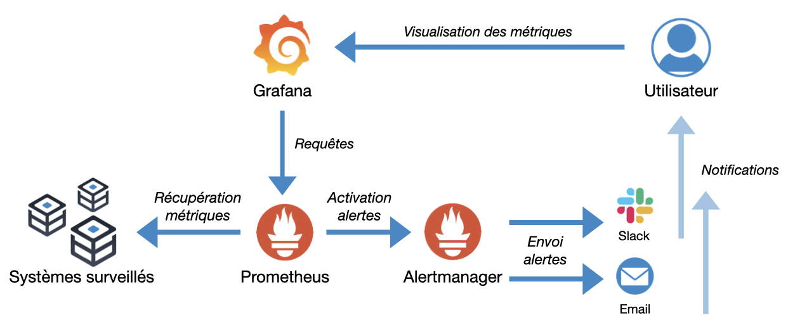

# Lab Monitoring - Prometheus + Grafana + App Web

## Objectif du lab

Dans ce lab, vous allez :

* Déployer une application web instrumentée
* Collecter des métriques avec Prometheus
* Visualiser ces métriques avec Grafana
* Observer le comportement de l’application en temps réel

👉 À la fin, vous comprendrez comment fonctionne une chaîne moderne d’observabilité.

---

## Architecture

```
User → App Web → /metrics → Prometheus → Grafana
```



---

## Structure du projet

```
monitoring-demo/
│
├── docker-compose.yml
├── prometheus.yml
│
└── app/
    ├── Dockerfile
    ├── package.json
    └── app.js
```

---

## Explication des composants

### docker-compose.yml

Ce fichier permet de lancer toute la plateforme :

* **app** : application web
* **prometheus** : collecte des métriques
* **grafana** : visualisation
* **node-exporter** : métriques système

👉 Une seule commande permet de tout démarrer.

---

### prometheus.yml

Configuration de Prometheus :

* Définit les cibles à surveiller
* Fréquence de collecte : 5 secondes

👉 Prometheus fonctionne en **mode pull** (il va chercher les métriques).

---

### Application Node.js

* Endpoint `/` : page web
* Endpoint `/metrics` : métriques exposées
* Compteur : `http_requests_total`

👉 Chaque appel HTTP est comptabilisé.

---

### Dockerfile

Permet de construire l’image de l’application :

* Installation des dépendances
* Exécution du serveur Node.js

---

## Lancer le lab

Dans un terminal :

```bash
docker-compose up -d --build
```

---

## Vérifications

### Application

http://localhost:3001

### Metrics

http://localhost:3001/metrics

### Prometheus

http://localhost:9090

### Grafana

http://localhost:3000

Login :

```
admin / admin
```

---

## Étape 1 – Explorer les métriques

Ouvrez :

```
http://localhost:3001/metrics
```

👉 Vous verrez des métriques comme :

```
http_requests_total
```

---

## Étape 2 – Utiliser Prometheus

Ouvrez Prometheus :

```
http://localhost:9090
```

### Requête 1

```
http_requests_total
```

👉 Affiche le nombre total de requêtes

---

### Requête 2 (importante)

```
rate(http_requests_total[1m])
```

👉 Affiche le nombre de requêtes par seconde

---

## Étape 3 – Configurer Grafana

1. Aller dans Grafana
2. Ajouter une datasource Prometheus

URL :

```
http://prometheus:9090
```

---

## Étape 4 – Créer un dashboard

1. New Dashboard
2. Add Visualization
3. Choisir Prometheus

### Requête

```
rate(http_requests_total[1m])
```

### Type

* Time series

### Nom

```
Traffic (req/s)
```

---

## Étape 5 – Générer du trafic

Dans un terminal :

```bash
while true; do curl http://localhost:3001; sleep 0.2; done
```

---

## 👀 Observation

* Dans Grafana → la courbe monte
* Arrêtez le script → la courbe redescend

---

## Ce que vous devez comprendre

### 1. Monitoring applicatif

Une application moderne expose ses propres métriques.

---

### 2. Prometheus

* Collecte les métriques
* Stocke les données
* Permet de faire des requêtes

---

### 3. Grafana

* Affiche les données
* Crée des dashboards

---

### 4. Temps réel

Les métriques sont visibles immédiatement.

---

## 🧠 À retenir

👉 On ne peut pas améliorer ce qu’on ne mesure pas.

👉 Prometheus collecte, Grafana visualise.

👉 Chaque action utilisateur devient une donnée.

---

## Bonus (optionnel)

### Importer un dashboard existant

Dans Grafana :

* Dashboard → Import
* ID : `1860`

👉 Dashboard Node Exporter (métriques système)

---

